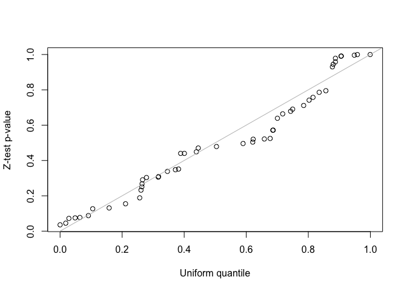
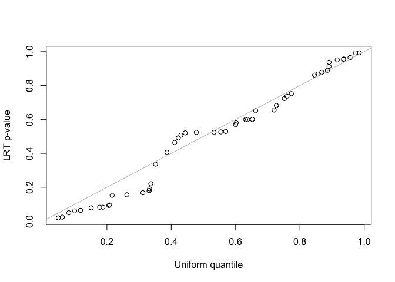

<!-- README.md is generated from README.Rmd. Please edit that file -->

# FLASH-MM

<!-- badges: start -->
<!-- badges: end -->

FLASH-MM is a method (package name: FLASHMM) for analysis of single-cell
differential expression using a linear mixed-effects model (LMM). The
mixed-effects model is a powerful tool in single-cell studies due to
their ability to model intra-subject correlation and inter-subject
variability.

FLASHMM package provides two functions, *lmm* and *lmmfit*, for fitting
LMM. The *lmm* function uses summary statistics as arguments. The
*lmmfit* function is a wrapper function of *lmm*, which directly uses
cell-level data and computes the summary statistics inside the function.
The lmmfit function is simple to be operated but it has a limitation of
memory use. For extremely large scale data, it is recommended to
precompute and store the summary statistics and then use *lmm* function
to fit LMM.

In summary, FLASHMM package provides the following main functions.

- *lmm*: fit LMM using summary-level data.
- *lmmfit*: fit LMM using cell-level data.
- *lmmtest*: perform statistical tests on the fixed effects and their
  contrasts.
- *contrast.matrix*: construct contrast matrix of the fixed effects for
  various comparisons.
- *simuRNAseq*: simulate multi-sample multi-cell-type scRNA-seq data.

## Installation

You can install FLASHMM package from CRAN:

``` r
install.packages("FLASHMM")
```

Or the development version from GitHub:

``` r
devtools::install_github("https://github.com/Baderlab/FLASHMM")
```

## Example

This is a basic example which shows you how to use FLASHMM to perform
single-cell differential expression analysis.

``` r
library(FLASHMM)
```

### Simulating scRNA-seq dataset with *simuRNAseq*

Simulate a multi-sample multi-cell-cluster scRNA-seq dataset that
contains 25 samples and 4 clusters (cell-types) with 2 treatments.

``` r
set.seed(2412)
dat <- simuRNAseq(nGenes = 50, nCells = 1000, nsam = 25, ncls = 4, ntrt = 2, nDEgenes = 6)
#> Message: the condition B is treated.
names(dat)
#> [1] "ref.mean.dispersion" "metadata"            "counts"             
#> [4] "DEgenes"             "treatment"

#counts and meta data
counts <- dat$counts
metadata <- dat$metadata
head(metadata)
#>       sam cls trt libsize
#> Cell1  B1   4   B     117
#> Cell2  A6   3   A      75
#> Cell3  A2   1   A     101
#> Cell4  B8   1   B      80
#> Cell5 B11   4   B     123
#> Cell6  A4   3   A     113
rm(dat)
```

The simulated data contains

- *counts*: a genes-by-cells matrix of expression counts
- *metadata*: a data frame consisting of samples (sam), cell-types (cls)
  and treatments (trt).
- *DEgenes*: differetially expressed (DE) genes.

### Differential expression analysis using LMM

The analyses involve following steps: LMM design, LMM fitting, and
hypothesis testing.

**1. Model design**

- Y: gene expression profile (log-transformed counts)
- X: design matrix for fixed effects
- Z: design matrix for random effects

``` r
Y <- log(counts + 1) 
X <- model.matrix(~ 0 + log(libsize) + cls + cls:trt, data = metadata)
Z <- model.matrix(~ 0 + sam, data = metadata)
d <- ncol(Z) 
```

**2. LMM fitting**

**Option 1**: Fit LMMs with *lmmfit* function using cell-level data.

``` r
fit <- lmmfit(Y, X, Z, d = d)
```

**Option 2**: Fit LMMs with *lmm* function using summary-level data.

``` r
##(1) Computing summary statistics
n <- nrow(X)
XX <- t(X)%*%X; XY <- t(Y%*%X)
ZX <- t(Z)%*%X; ZY <- t(Y%*%Z); ZZ <- t(Z)%*%Z
Ynorm <- rowSums(Y*Y)

##(2) Fitting LMMs
fitss <- lmm(XX, XY, ZX, ZY, ZZ, Ynorm = Ynorm, n = n, d = d)

identical(fit, fitss)
#> [1] TRUE
```

**3. Hypothesis testing**

``` r
## Testing coefficients (fixed effects)
test <- lmmtest(fit)
# head(test)

## The t-value and p-values are identical with those provided in the LMM fit.
range(test - cbind(t(fit$coef), t(fit$t), t(fit$p)))
#> [1] 0 0

fit$p[, 1:4]
#>                     Gene1        Gene2        Gene3        Gene4
#> log(libsize) 0.0003936946 1.226867e-09 0.0003216502 4.036515e-05
#> cls1         0.0158766072 1.300111e-06 0.0209667982 7.686618e-03
#> cls2         0.0095791682 7.060831e-07 0.0248727531 1.220264e-02
#> cls3         0.0106867912 5.971329e-07 0.0319158551 9.862323e-03
#> cls4         0.0145925607 6.556356e-07 0.0266262016 7.087769e-03
#> cls1:trtB    0.3846324624 7.144869e-01 0.8795840262 3.319065e-01
#> cls2:trtB    0.0387066712 2.726210e-01 0.9114719020 4.580478e-01
#> cls3:trtB    0.1322220329 1.338870e-01 0.7144983040 3.745743e-01
#> cls4:trtB    0.7442524470 9.307711e-02 0.6485383571 5.182577e-01

# fit$coef[, 1:4] fit$t[, 1:4]
```

**Using contrasts**: We can make comparisons using contrasts. For
example, the effects of treatment B vs A in all clusters can be tested
using the contrast constructed as follows.

``` r
ct <- numeric(ncol(X))
index <- grep("B", colnames(X))
ct[index] <- 1/length(index)

test <- lmmtest(fit, contrast = ct)
head(test)
#>             _coef         _t        _p
#> Gene1  0.09445436  1.4753256 0.1404426
#> Gene2  0.10333114  1.4540794 0.1462409
#> Gene3 -0.02117872 -0.2900354 0.7718498
#> Gene4  0.10281315  0.9531558 0.3407436
#> Gene5 -0.12106061 -1.3918602 0.1642770
#> Gene6  0.06756558  1.1553425 0.2482287
```

## And More

### Using ML method

To use the maximum likelihood (ML) method to fit the LMM, set method =
‘ML’ in the *lmm* and *lmmfit* functions.

``` r
##Fitting LMM using ML method
fit1 <- lmmfit(Y, X, Z, d = d, method = "ML")
```

### LMM with two-components random effects

If appropriate, for example, we also take account of the measurement
time as a random effect within a subject, we may fit data using the LMM
with two-component random effects.

``` r
## Design matrix for two-component random effects: Suppose the data contains
## the measurement time points, denoted as 'time', which are randomly
## generated.

set.seed(2508)
n <- nrow(metadata)
metadata$time <- sample(1:2, n, replace = TRUE)
Z <- model.matrix(~0 + sam + sam:time, data = metadata)
d <- c(ncol(Z)/2, ncol(Z)/2)  #dimension

## Fit the LMM with Two-component random effects.
fit2 <- lmmfit(Y, X, Z, d = d, method = "ML")
```

### Testing variance components

We use both z-test and likelihood ratio test (LRT) to test the second
variance component in the LMM with two-component random effects. Since
the simulated data was generated by the LMM with single-component random
effects, the second variance component should be zero. For the LRT test,
the two nested models must be fitted using the same method, either REML
or ML, and use the same design matrix, $X$, when using REML method.

``` r
##(1) z-test for testing the second variance component
##Z-statistics for the second variance component
i <- grep("var2", rownames(fit2$theta)) 
z <- fit2$theta[i, ]/fit2$se.theta[i, ] 
##One-sided z-test p-values for hypotheses:
##H0: theta <= 0 vs H1: theta > 0
p <- pnorm(z, lower.tail = FALSE)

##(2) LRT for testing the second variance component
LRT <- 2*(fit2$logLik - fit1$logLik)
pLRT <- pchisq(LRT, df = 1, lower.tail = FALSE)

##QQ-plot
qqplot(runif(length(p)), p, xlab = "Uniform quantile", ylab = "Z-test p-value")
abline(0, 1, col = "gray")
```



``` r
qqplot(runif(length(pLRT)), pLRT, xlab = "Uniform quantile", ylab = "LRT p-value")
abline(0, 1, col = "gray")
```



``` r
sessionInfo()
#> R version 4.4.3 (2025-02-28)
#> Platform: x86_64-apple-darwin20
#> Running under: macOS Monterey 12.7.6
#> 
#> Matrix products: default
#> BLAS:   /Library/Frameworks/R.framework/Versions/4.4-x86_64/Resources/lib/libRblas.0.dylib 
#> LAPACK: /Library/Frameworks/R.framework/Versions/4.4-x86_64/Resources/lib/libRlapack.dylib;  LAPACK version 3.12.0
#> 
#> locale:
#> [1] en_US.UTF-8/en_US.UTF-8/en_US.UTF-8/C/en_US.UTF-8/en_US.UTF-8
#> 
#> time zone: America/Toronto
#> tzcode source: internal
#> 
#> attached base packages:
#> [1] stats     graphics  grDevices utils     datasets  methods   base     
#> 
#> other attached packages:
#> [1] FLASHMM_1.2.1
#> 
#> loaded via a namespace (and not attached):
#>  [1] Matrix_1.7-3       miniUI_0.1.2       compiler_4.4.3     promises_1.3.3    
#>  [5] Rcpp_1.1.0         callr_3.7.6        later_1.4.2        yaml_2.3.10       
#>  [9] fastmap_1.2.0      lattice_0.22-7     mime_0.13          R6_2.6.1          
#> [13] curl_6.4.0         knitr_1.50         MASS_7.3-65        htmlwidgets_1.6.4 
#> [17] desc_1.4.3         profvis_0.4.0      shiny_1.11.1       rlang_1.1.6       
#> [21] cachem_1.1.0       httpuv_1.6.16      xfun_0.52          fs_1.6.6          
#> [25] pkgload_1.4.0      memoise_2.0.1      cli_3.6.5          formatR_1.14      
#> [29] magrittr_2.0.3     ps_1.9.1           grid_4.4.3         processx_3.8.6    
#> [33] digest_0.6.37      rstudioapi_0.17.1  xtable_1.8-4       remotes_2.5.0     
#> [37] devtools_2.4.5     lifecycle_1.0.4    vctrs_0.6.5        evaluate_1.0.4    
#> [41] glue_1.8.0         urlchecker_1.0.1   sessioninfo_1.2.3  pkgbuild_1.4.8    
#> [45] rmarkdown_2.29     purrr_1.1.0        tools_4.4.3        usethis_3.1.0.9000
#> [49] ellipsis_0.3.2     htmltools_0.5.8.1
```

# Citation

If you find FLASH-MM useful for your publication, please cite:

Xu & Pouyabahar et al., FLASH-MM: fast and scalable single-cell
differential expression analysis using linear mixed-effects models,
bioRxiv 2025.04.08.647860; doi:
<https://doi.org/10.1101/2025.04.08.647860>
